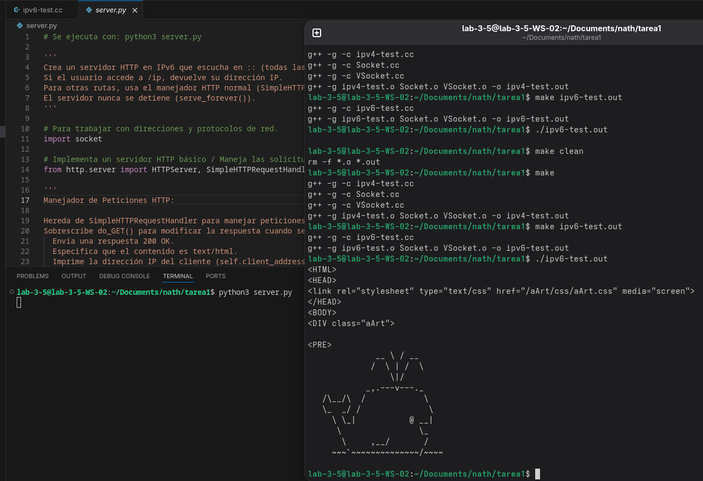

## Como compilar y ejecutar
* La evidencia que funcia esta en la imagen adjunta en la carpeta.
Primero abrir una terminal y correr el server de python con python3 server.py
Luego en otra terminal hacer make clean, make, make ipv6-test.out y luego ejecutar con ./ipv6-test.out

Objetivo
   Completar las clase "VSocket" y "Socket" en C++ para lograr el intercambio de mensajes entre computadoras que no comparten memoria utilizando el protocolo TCP en IPv6

Tareas

   - Completar las clases C++ "VSocket" y "Socket" para poder intercambiar mensajes entre procesos que no comparten memoria.
   - Se facilita las interfaces "VSocket.h" y "Socket.h".  Para esta tarea deben completar la funcionalidad para IPv6.

   - Los ejemplos "ipv4-test.cc" y "ipv6-test.cc" deben funcionar correctamente

Descripción detallada:
   - Clase Socket (revisar el archivo Socket.h para conocer los detalles)
      - int MakeConnection( const char *, const char * );

   - Clase VSocket (revisar el archivo VSocket.h para conocer los detalles)

      virtual int EstablishConnection( const char *, int ) = 0;

      virtual int EstablishConnection( const char *, const char * ) = 0;

      VSocket::EstablishConnection( const char * hostip, int port );	// connect to server (char *), and port (int)
         // Para IPv6 
            struct sockaddr_in6  host6;
            struct sockaddr * ha;

            memset( &host6, 0, sizeof( host6 ) );
            host6.sin6_family = AF_INET6;
            st = inet_pton( AF_INET6, hostip, &host6.sin6_addr );
            if ( 0 <= st ) {	// 0 means invalid address, -1 means address error
               throw std::runtime_error( "Socket::Connect( const char *, int ) [inet_pton]" );
            }
            host6.sin6_port = htons( port );
            ha = (struct sockaddr *) &host6;
            len = sizeof( host6 );
            st = connect( this->id, ha, len );
            if ( -1 == st ) {
               throw std::runtime_error( "Socket::Connect( const char *, int ) [connect]" );
            }

      VSocket::MakeConnection( const char *, const char *);	// connect to server (char *), and service (char *)
         ...
         struct addrinfo hints, *result, *rp;

         memset(&hints, 0, sizeof(struct addrinfo));
         hints.ai_family = AF_UNSPEC;    /* Allow IPv4 or IPv6 */
         hints.ai_socktype = SOCK_STREAM; /* Stream socket */
         hints.ai_flags = 0;
         hints.ai_protocol = 0;          /* Any protocol */

         st = getaddrinfo( host, service, &hints, &result );

         for ( rp = result; rp; rp = rp->ai_next ) {
            st = connect( idSocket, rp->ai_addr, rp->ai_addrlen );
            if ( 0 == st )
               break;
         }

         freeaddrinfo( result );
         ...

Referencias
   https://os.ecci.ucr.ac.cr/ci0123/Asignaciones/SocketsCourse.ppt

## Evidencia que funciona

