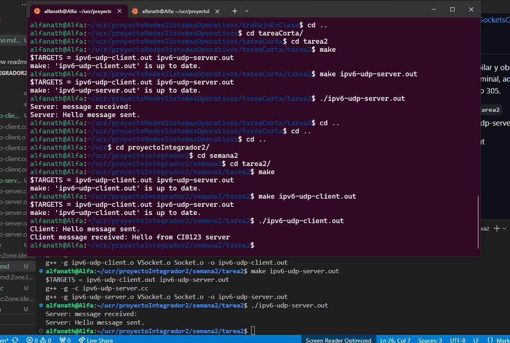

## Objetivo

   Completar las clases "VSocket" y "Socket" en C++ para lograr el intercambio de mensajes entre computadoras que no comparten memoria
utilizando datagramas con el protocolo UDP en IPv6.

## Tareas

   - Completar la clase C++ "Socket" para poder intercambiar mensajes entre procesos que no comparten memoria. Se facilita los archivos base para las clases, deben completar la funcionalidad para IPv6:
      Bind()
      SentTo()
      ReceiveFrom()

   - Los ejemplos "ipv6-udp-client.cc" y "ipv6-udp-server.cc" deben funcionar correctamente.

## Referencias
   https://os.ecci.ucr.ac.cr/ci0123/Asignaciones/SocketsCourse.ppt

## Compilar y ejecutar

Se necesitan dos terminales para poder compilar y observar el resultado que son unos mensajes en cada terminal, además la versión de IPv6 solo funciona en el laboratorio 305.

En la terminal 1:
   - Posicionarse en el directorio:`./semana2/tarea2`
   - Limpiar los ejecutables: `make clean`
   - Compilar el proyecto con: `make`
   - Compilar el servidor: `make ipv6-udp-server.out`
   - Ejecutar el servidor: `./ipv6-udp-server.out`

En la terminal 2:
   - Compilar el proyecto con: `make`
   - Compilar el servidor: `make ipv6-udp-client.out`
   - Ejecutar el servidor: `./ipv6-udp-client.out`

## Evidencia de funcionamiento

