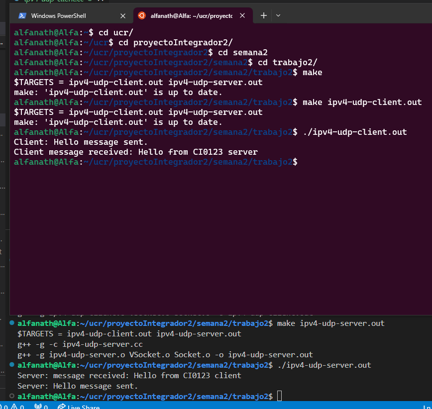

## Objetivo

Completar las clases "VSocket" y "Socket" para lograr el intercambio de mensajes utilizando el protocolo UDP en IPv4,
para lograr la transferencia de datagramas.

Para este intercambio de datagramas no es necesario establecer una conexión.

Para este trabajo, será necesario construir un pequeño servidor, quien recibirá los mensajes, identificará el emisor
y nos devolverá una tira, y un cliente quién se encargará de enviar el primer datagrama.


## Procedimiento

1) Funcionamiento UDP
   - Completar la clase "VSocket" para poder intercambiar mensajes UDP.

      - Se facilita la interfaz "VSocket.h".

      - Programar el método ` int Bind( int ) ` que se utiliza en el servidor (man bind), este método lo vamos a utilizar posteriormente para IPv6.

      ```
      host4.sin_family = AF_INET;
      host4.sin_addr.s_addr = htonl( INADDR_ANY );
      host4.sin_port = htons( port );
      memset(host4.sin_zero, '\0', sizeof (host4.sin_zero));
      ```

      - Programar los métodos: ` size_t sendTo( const void *, size_t, void * ) ` y
                               ` size_t recvFrom(void *, size_t, void * ) ` de manera que los procesos puedan intercambiar mensajes utilizando UDP.

   - Archivos facilitados:
      (clase VSocket de las asignaciones anteriores)
      ipv4-udp-client.cc
      ipv4-udp-server.cc


## Referencias

Acceso al manual de Unix: "man sendto" o "man recvfrom".

https://os.ecci.ucr.ac.cr/ci0123/Asignaciones/SocketsCourse.ppt


## Compilar y ejecutar

Se necesitan dos terminales para poder compilar y observar el resultado que son unos mensajes en cada terminal.

En la terminal 1:
   - Posicionarse en el directorio:`./semana2/trabajo2`
   - Poner la IP de su computadora local en el ipv4-udp-client.cc
   - Limpiar los ejecutables: `make clean`
   - Compilar el proyecto con: `make`
   - Compilar el servidor: `make ipv4-udp-server.out`
   - Ejecutar el servidor: `./ipv4-udp-server.out`

En la terminal 2:
   - Compilar el proyecto con: `make`
   - Compilar el servidor: `make ipv4-udp-client.out`
   - Ejecutar el servidor: `./ipv4-udp-client.out`


## Evidencia de funcionamiento

