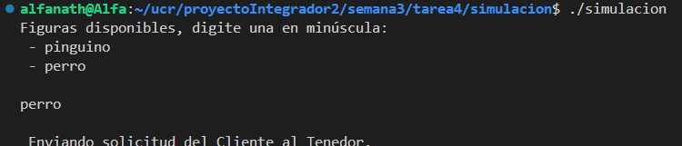
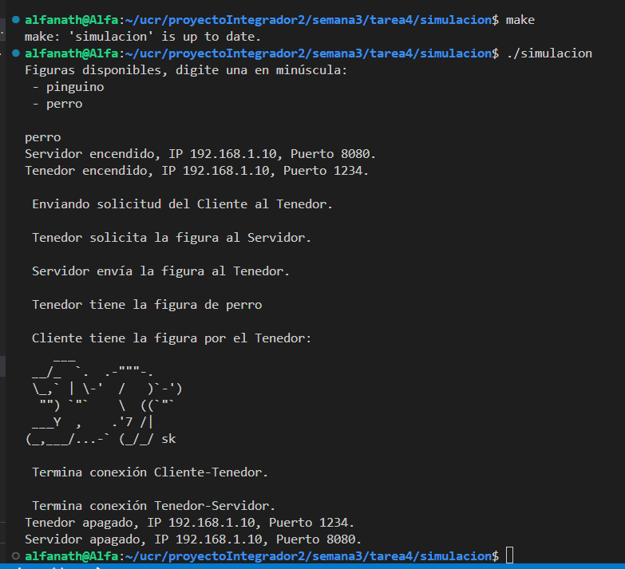

## Compilar y ejecutar

- Estar en la carpeta simulacion
- Hacer make en la terminal
- Luego hacer ./simulacion

## Como usarlo

Al ejecutarse, se despliega la lista de figuras de animalitos disponibles, para poder visualizar la que gusta, debe digitar la palabra tal cual se muestra en el listado y solo se puede solicitar una a la vez, luego presiona enter y puede observar el proceso explicativo de cómo funciona el programa para mostrar la figura de caracteres.

## Explicación

La simulación es hecha en C++ que se compila con Makefile, la idea de esta tarea es simular de forma mini el proyecto de forma sencilla, se hace la conexión del cliente con el tenedor y servidor, entonces se le despliega al cliente la lista de las figuras de los animalitos disponibles. Además como se menciona en el protocolo, se notifica cuando el servidor y el tenedor se encienden y se apagan, esto mismo se toma en cuenta en la simulación.

Almacena la lista de figuras de los animmalitos disponibles en un map y con una cola de mensajes se gestionan las solicitudes de los clientes y para controlar el acceso se utiliza un Mutex ya que se usan hilos.