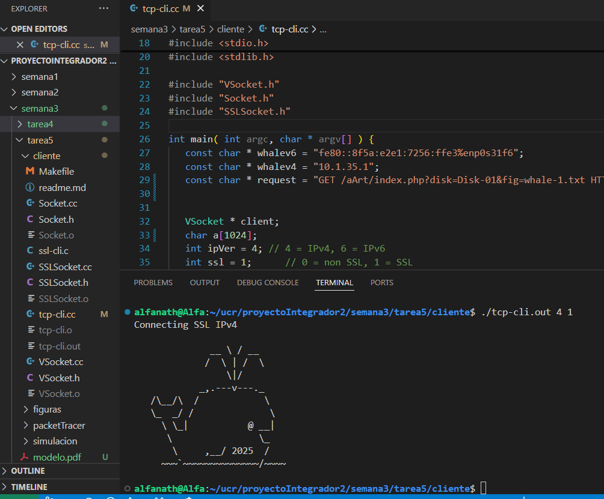

Esta versión de código es solo para probar el IPv4 con SSL.
Compilar con make
Ejecutar con ./tcp-cli.out 4 1
Si no se ponen los parámetros en el comando de ejecutar, automáticamente se hace el IPv4 con SSL ya que la línea 34 y 35 está configurado así.

