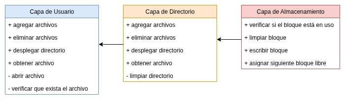

# File System

## Versión 1. Almacenamiento continuo

### Requerimientos

Se listan las acciones que el modelo de almacenamiento debe poder ofrecer al
usuario o servidor que lo utiliza.

- listar archivos (directorio)
- agregar un archivo
- eliminar un archivo
- obtener un archivo

### Diseño por capas

Debido a que las funcionalidad del sistema de archivos requiere de la
interacción entre diversos componentes, se plantea un modelo de capas para
facilitar su implementación, delimitando así los servicios que debe ofrecer
cada componente, dejando los detalles de funcionalidad para la siguiente etapa.

#### Capa de usuario

Esta capa ofrece al usuario las opciones que lista los requerimientos.

Esta es la capa superior y utiliza las demás capas para lograr proveer sus
servicios. Esta capa es la encargada de verificar que las solicitudes realizadas
sean válidas y tiene tendrá la capacidad de manejar errores del usuario.

#### Capa de directorio

Esta capa funciona como una interfaz para la capa de usuario. Es por medio del
directorio que el usuario puede ubicar y obtener la información de los archivos.

Servicios:
- mostrar directorio
- agregar archivo al directorio
- eliminar archivo al directorio
- limpiar directorio
- obtener archivo

Esta capa asume que siempre recibirá acciones válidas y coherentes, ya que
la capa de usuario se encarga proveer fiabilidad a las acciones que le solicita.

#### Capa de almacenamiento

Esta capa se encarga de administrar la memoria de forma directa, escribiendo
y leyendo los bloques. Esta capa se comunica con el directorio y le ayuda a
guardas los archivos y leer de ellos, así como eliminarlos

Servicios:
- escribir bloque
- limpiar bloque
- verificar si el bloque está limpio
- asignar un bloque disponible

También se encarga de proteger a los bloques 0 y 1 que, por defecto, son parte
del sistema del modelo de almacenamiento, funcionando como bloque vacío e
inicio del directorio.

### Especificaciones

Los bloques se asignan inicializados en 0.

Se utiliza memoria contigua.

El bloque 0 se deja vacío y se utiliza para indicar un puntero nulo.

El directorio inicial se ubica en el bloque 1.

Almacenamiento: medio megabyte = 512 kB

Bloques de 256 bytes

2048 bloques en total

Con 2 bytes basta para indexar el bloque más grande
- (2048 < 65536 = 2^16)

### Directorio
Se diseñó la siguiente estructura de datos para almacenar el directorio.

Un bloque que contiene una tabla para guardar información de archivos que cada uno suma 36 B en total.
- nombre (32 B)
- bloque de inicio (2B)
- bloque final (2B)

Con 7 directorios se ocupa 252 B. Quedan 4 bytes libres que se pueden usar como punteros a otras estructuras iguales de ser necesarias. Esto le permite al directorio crecer dinámicamente.
Como sea, por simplicidad se opta por realizar un único puntero por directorio,
existiendo en desperdicio de 2 bytes por directorio.

Si no hay otros directorios, apuntan al bloque 0.