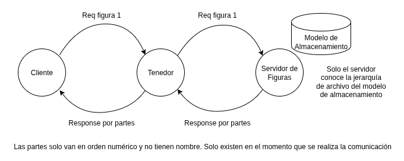

## Protocolo Grupal - Borrador

Se pretende unificar las mejores partes de ambos protocolos, grupo 1 y 2, para
crear un protocolo conjunto que incorpore las funcionalidades de ambos. En
la carpeta se encuentran los protocolos individuales de ambos equipos.

Integrantes:

- Rodrigo
- Jordan Barquero
- Nathalie Alfaro
- Jesús Porras
- Alejandro
- Jordan Obando
- Jorge
- Gabriel

## Discusión de Protocolos

## Uso de directorios

Como se muestra en la imagen, la comunicación entre los componentes solo
contiene la información de la figura. No debe contener el directorio y la ruta
en la que está almacenada la figura, ya que es trabajo del servidor conocer
la ruta de las figuras que tiene disponible. Del mismo modo, el número del
disco en el cual se encuentra la figura no es necesario.

El servidor al encenderse hace un listado de las figuras que tiene (puede que
él guarde la ruta, pero no la comparte) y la comparte con el tenedor, por lo
que las solicitudes solo necesitan el nombre de la figura. Esto se consultó con
el profesor y el diagrama está basado en un dibujo hecho por el profesor.

## Partes

Según el profesor, no es necesario que el cliente conozca las partes. Las partes
se crean cuando el mensaje es muy grande y debe ser enviado en varios paquetes.
No deben tener nombres y no es relevante que el cliente solicite cuáles partes
tiene  una figura (son lógicas y se crean en el momento que se solicita la
figura) o que pueda solo solicitar una parte de la figura.

Hay que agregar un verb para que el cliente pueda solicitar la figura completa.

## Máquina de estados

Explicarla mejor. Mencionar si es un diseño de ejecución u otro tipo de diseño.

## Handler

Agregar una explicación del handler y su propósito, ya que no se menciona.

## Logging

Sería conveniente expandir esto y agregarlo a una sección separada. También
vale la pena poner un ejemplo e indicar si todos los componentes debes realizar
el logging o solo el tenedor y servidor.

## TCP o UDP

Lo bueno de TCP es que no ocupa Acknowledgements (ACK) y al enviar los paquetes en
orden, se pueden construir conforme llegan.

UDP es más rápido, pero hay que mandar ACKs y los paquetes hay que ordenarlos,
lo cual puede complicar más el código del tenedor y el cliente.

## Manera de conectarse (handshake)
Como el grupo 2 carece de conexión, se propone utilizar la del grupo 1. Se
necesita elaborar más en cómo se realiza la conexión con los posibles casos
y un debido ejemplo.